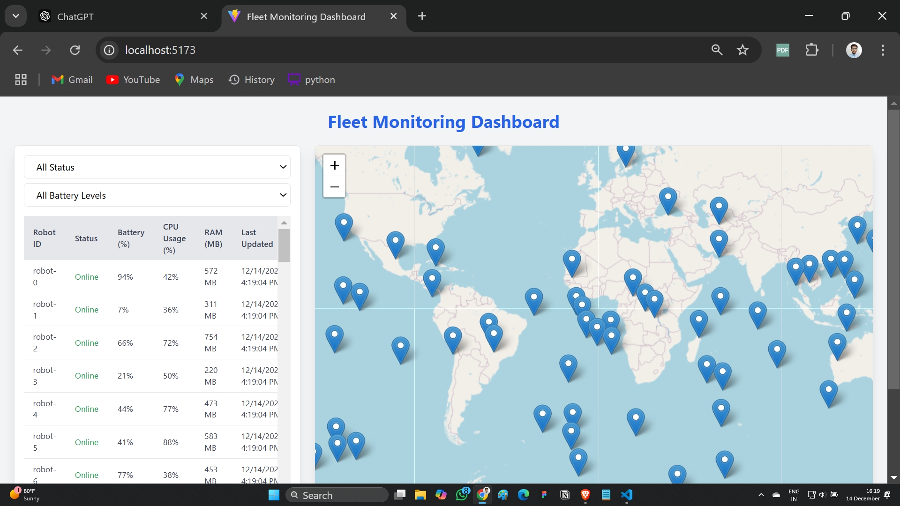
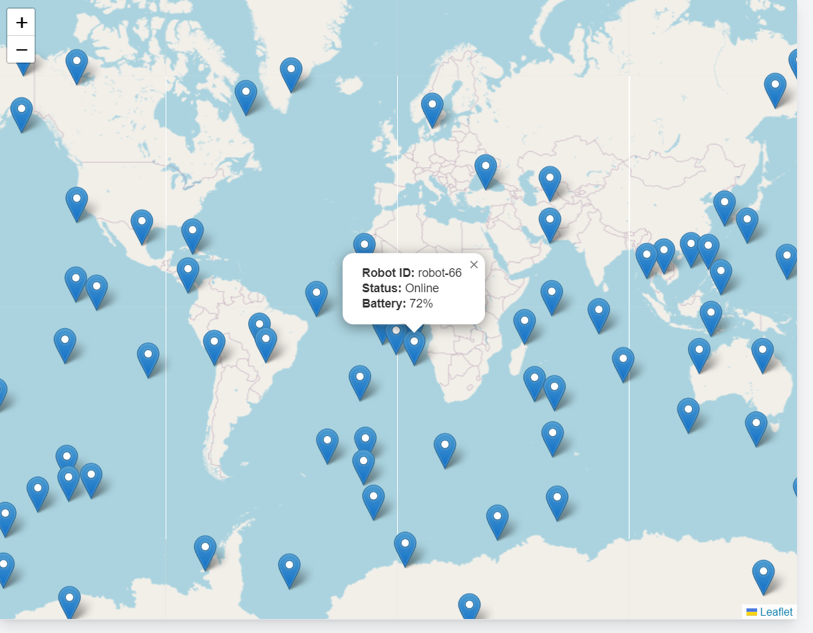
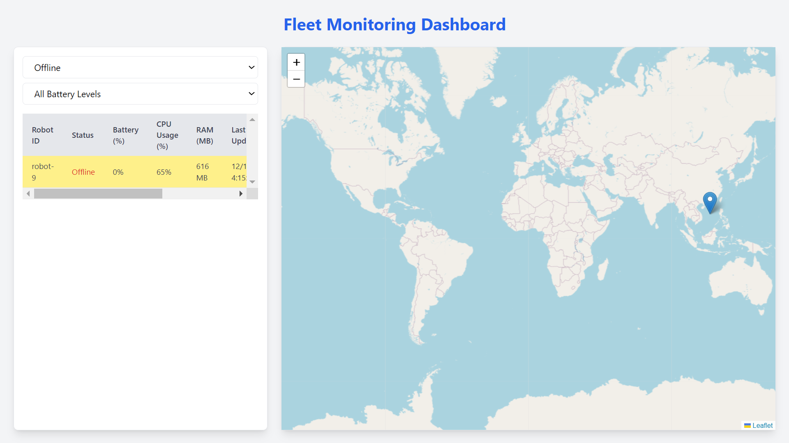

# 🤖 **Fleet Monitoring Dashboard**  

🚀 A powerful **real-time dashboard** to monitor and visualize the status and telemetry data of multiple robots. Perfect for tracking locations, resource usage, and performance in one place!  

---

## 🛠️ **Features**  
- 📋 **Robot List**: View details for up to 10 robots:  
  - Robot ID (UUID)  
  - Online/Offline status  
  - Battery percentage 🔋  
  - CPU usage 💻  
  - RAM consumption 🧠  
  - Last updated timestamp ⏲️  
  - Location coordinates 🌍  

- 🌐 **Real-Time Updates**:  
  - Updates every 5 seconds via **WebSockets** or periodic polling.  

- 🗺️ **Map View**:  
  - Visualize robots' current positions using **Leaflet.js** or **Mapbox**.  

- ⚠️ **Alerts**:  
  - Highlight robots that are offline or have a low battery (<20%).  

---

## 🧩 **Tech Stack**  

### Backend 🖥️  
- **Framework**: [FastAPI](https://fastapi.tiangolo.com) or [Flask](https://flask.palletsprojects.com)  
- **Simulated Data**: Mock telemetry data generated for up to 10 robots.  

### Frontend 🌟  
- **Framework**: [React.js](https://react.dev)  
- **Map Library**: [Leaflet.js](https://leafletjs.com)
---

## 🚀 **Getting Started**  

Follow these steps to run the application on your local system:  

### 1️⃣ **Clone the Repository**  
```bash
git clone https://github.com/yourusername/robot-dashboard.git
cd robot-dashboard
```

### 2️⃣ **Backend Setup**  

1. Navigate to the `backend` folder:  
   ```bash
   cd backend
   ```
2. Create and activate a virtual environment:  
   ```bash
   python -m venv venv
   source venv/bin/activate    # On Windows: venv\Scripts\activate
   ```
3. Install dependencies:  
   ```bash
   pip install -r requirements.txt
   ```
4. Run the server:  
   ```bash
   uvicorn app.main:app --reload
   ```

### 3️⃣ **Frontend Setup**  

1. Navigate to the `frontend` folder:  
   ```bash
   cd ../frontend
   ```
2. Install dependencies:  
   ```bash
   npm install
   ```
3. Start the development server:  
   ```bash
   npm run dev
   ```
4. Open your browser and visit:  
   ```
   http://localhost:5173
   ```

---

## 📸 **Screenshots**  

### 🖥️ **Dashboard Overview**  


### 🗺️ **Map View**  



### ⚠️ **Alerts for Offline/Low Battery**  
 

---

## 📄 **API Endpoints**  

### 1️⃣ **Robot Data (GET)**  
- **URL**: `/api/robots`  
- **Description**: Fetches details of all robots.  

### 2️⃣ **WebSocket Updates**  
- **URL**: `/ws/updates`  
- **Description**: Provides real-time telemetry updates.  

---

## 🤝 **Contributing**  

Want to contribute? Feel free to open a pull request or raise an issue!  

---

## 📝 **License**  

This project is licensed under the [MIT License](LICENSE).  

---

## ⭐ **Show Your Support**  

If you like this project, don't forget to star ⭐ the repository!  
